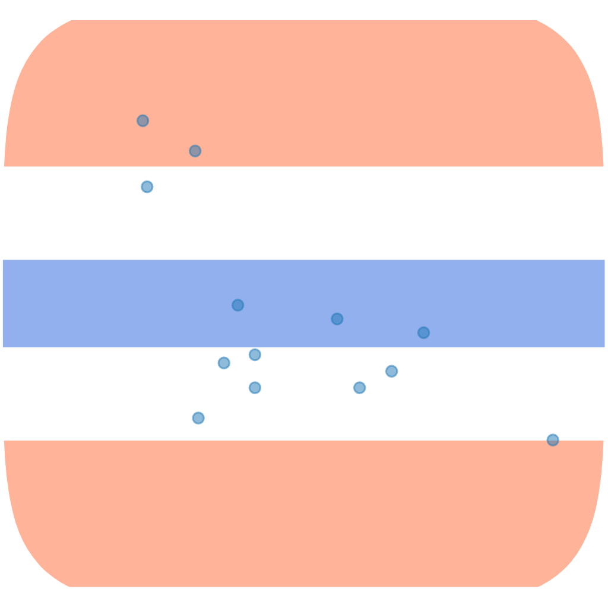
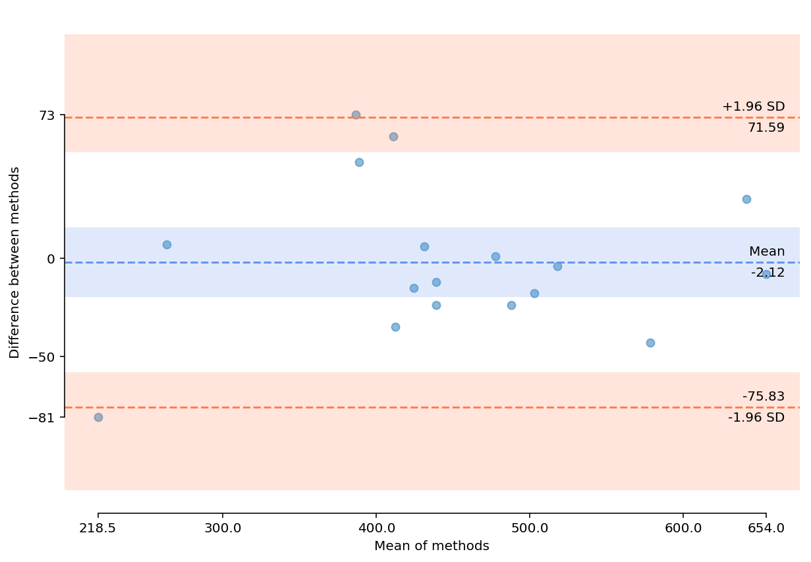

# pyCompare 

     

A Python module for generating [Bland-Altman](https://en.wikipedia.org/wiki/Bland–Altman_plot) plots to compare two sets of measurements.

## Installation

To install _via_ [pip](https://pypi.org/project/pyCompare/), run:

    pip install pyCompare

Installation with pip allows the usage of the uninstall command:

    pip uninstall pyCompare

## Documentation

### blandAltman(&nbsp;)

    blandAltman(data1, data2,
                limitOfAgreement=1.96,
                confidenceInterval=95,
                confidenceIntervalMethod='approximate',
                detrend=None,
                **kwargs)

Generate a Bland-Altman plot to compare two sets of measurements of the same value.

`data1` and `data2` should be 1D numpy arrays of equal length containing the paired measurements.

If not `None` plot confidence interval over the *x*% range with `confidenceInterval=x`

Confidence intervals on the mean difference and limit of agreement may be calculated using:
- 'exact paired' uses the exact paired method described by Carkeet
- 'approximate' uses the approximate method described by Bland & Altman

The 'exact paired' method will give more accurate confidence intervals on the limits of agreement when the number of paired measurements is low (approx < 100), at the expense of much slower plotting time.

The *detrend* parameter supports the following options:
- ``None`` do not attempt to detrend data - plots raw values
- 'Linear' attempt to model and remove a multiplicative offset between each assay by linear regression
- 'ODR' attempt to model and remove a multiplicative offset between each assay by orthogonal distance regression

'ODR' is the recommended method if you do not use ``None``.

Plots are displayed using the current matplotlib backend by default, or may be saved with the `savePath=` argument.

When saving, png format graphics are saved by default:

    blandAltman(data1, data2,
                savePath='SavedFigure.png')

The save format type can be chosen from those known by [matplotlib](https://matplotlib.org/api/_as_gen/matplotlib.pyplot.savefig.html) with the `figureFormat=` argument:

    blandAltman(data1, data2,
                savePath='SavedFigure.svg',
                figureFormat='svg)

#### References

- Altman, D. G., and Bland, J. M. “Measurement in Medicine: The Analysis of Method Comparison Studies” Journal of the Royal Statistical Society. Series D (The Statistician), vol. 32, no. 3, 1983, pp. 307–317. [JSTOR](https://www.jstor.org/stable/2987937).
- Altman, D. G., and Bland, J. M. “Measuring agreement in method comparison studies” Statistical Methods in Medical Research, vol. 8, no. 2, 1999, pp. 135–160. [DOI](https://doi.org/10.1177/096228029900800204).
- Carkeet, A. "Exact Parametric Confidence Intervals for Bland-Altman Limits of Agreement" Optometry and Vision Science, vol. 92, no 3, 2015, pp. e71–e80 [DOI](https://doi.org/10.1097/OPX.0000000000000513).
